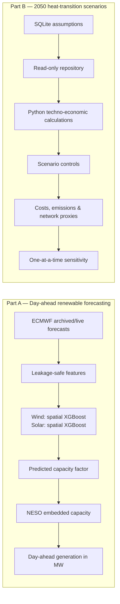
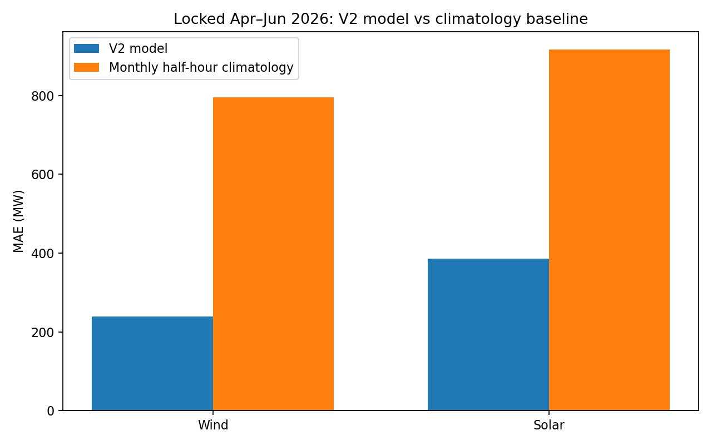
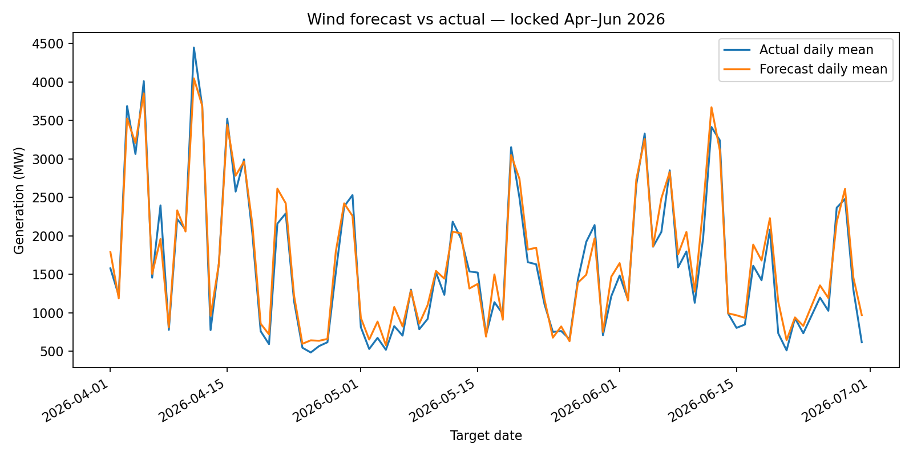
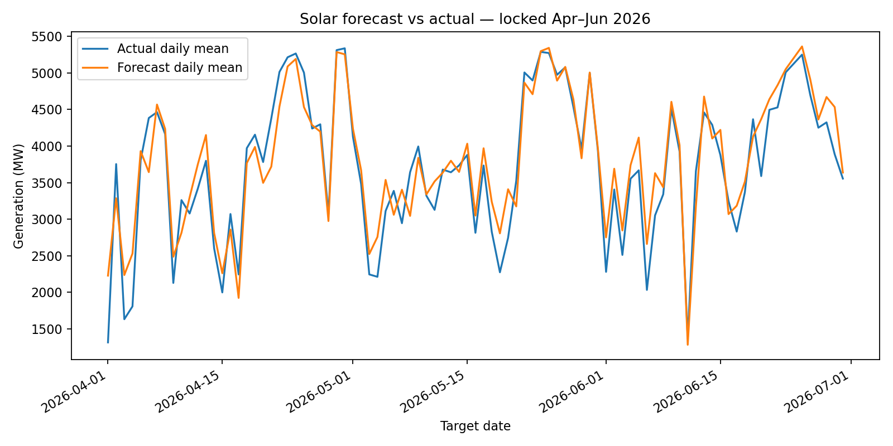

# GB Renewable Forecast & Energy Transition Explorer

[](https://gb-renewable-forecast.onrender.com)


A deployed energy-analytics portfolio combining two complementary capabilities:

1. **Day-ahead forecasting** of Great Britain's embedded wind and solar generation using leakage-safe machine learning.
2. **2050 heat-transition scenario analysis** comparing simplified electrification, hybrid and low-carbon-gas pathways.

The two models share one application but remain **separate analytical engines**. The forecasting model predicts an observable next-day outcome; the scenario model explores transparent what-if assumptions.

> **Live dashboard:** https://gb-renewable-forecast.onrender.com  
> Render's free tier may take around a minute to wake after a period of inactivity.

## Quick tour

| Area | Question answered | Open |
|---|---|---|
| **Day-ahead Forecast** | What will embedded wind and solar generation look like tomorrow? | [Open forecast](https://gb-renewable-forecast.onrender.com/) |
| **Forecast Performance** | How well do the models perform, and what did they predict versus what actually happened? | [Open performance](https://gb-renewable-forecast.onrender.com/performance) |
| **2050 Heat Scenarios** | What would different heat-transition assumptions imply for cost, emissions and network use? | [Open scenarios](https://gb-renewable-forecast.onrender.com/scenarios) |
| **Models, Data & Validation** | How are the models, assumptions, equations and validation evidence constructed? | [Open guide](https://gb-renewable-forecast.onrender.com/methodology) |

## What this project demonstrates

- **Energy forecasting:** half-hourly GB embedded wind and solar forecasts using archived/live ECMWF weather and NESO generation/capacity data.
- **Leakage-safe ML evaluation:** chronological train/validation/test splits, archived forecast inputs, untouched final test data and a climatology baseline.
- **Transparent validation:** aggregate MAE/R²/skill metrics plus a date-level Forecast vs Actual explorer.
- **Energy-transition modelling:** SQLite-backed 2050 heat pathways with annual cost, emissions, investment and network-pressure proxies.
- **Techno-economic sensitivity:** deterministic ±20% one-at-a-time sensitivity on key assumptions.
- **Production-style engineering:** Python, SQL/SQLite, Dash/Plotly, model packaging, offline tests, GitHub Actions preparation and Render deployment.

## Two analytical engines



## Day-ahead renewable forecasting

The forecasting model estimates **GB embedded wind and solar generation for every settlement period of the following UK calendar day**.

The production convention is:

- nominal issue time: **09:00 Europe/London**;
- weather run: issue-date **00 UTC ECMWF IFS HRES**;
- target: the following local calendar day;
- resolution: **30 minutes**, including 46-, 48- and 50-period daylight-saving days;
- wind model: **XGBoost** with 10-location wind-speed and direction features;
- solar model: **XGBoost** with 10-location radiation and cloud-cover features.

The models predict capacity factor first, then convert it to MW using official embedded capacity:

\[
\hat{G}_t = \widehat{CF}_t \times K_t
\]

where \(\hat{G}_t\) is predicted generation in MW, \(\widehat{CF}_t\) is predicted capacity factor and \(K_t\) is embedded capacity in MW.

### Locked test performance

Candidate specifications were frozen after four expanding chronological development folds covering April 2024 to March 2026. The results below come from the locked **April–June 2026 test period** (90 usable target days) and were evaluated only after model selection.

| Target | Model | Test MAE | Test R² | Skill vs monthly climatology |
|---|---|---:|---:|---:|
| Embedded wind generation | Spatial XGBoost | **239.1 MW** | **0.912** | **70.0% lower MAE** |
| Embedded solar generation | Spatial XGBoost | **385.5 MW** | **0.974** | **58.0% lower MAE** |

The application also lets users inspect individual test dates and compare the model prediction directly with the later observed NESO generation.

### Validation evidence

<p align="center">
  
</p>

<p align="center">
  
  
</p>

**Evaluation safeguards**

- all development folds and the locked test are chronological; there is no random split;
- hyperparameter/model selection uses only expanding development folds, while headline metrics use the locked test;
- archived weather forecasts are used for backtesting, not realised future weather;
- monthly half-hour climatology fitted on development data is retained as a simple benchmark;
- five unavailable official-source target dates, 6–10 August 2025, plus the reproducible 24 June 2026 archive temperature gap are explicitly excluded instead of fabricated or substituted;
- locked April–June 2026 predictions remain committed and inspectable.
- An aborted first evaluator read occurred after candidate freeze and before any holdout metrics were produced; the incident and unchanged selection state are documented in `docs/locked_test_access_incident.json`.

The system forecasts **embedded generation only**; it is not a forecast of all GB renewable output.

## 2050 Heat and Energy Network Transition Explorer

The Scenario Explorer asks a different question: **what would alternative heat-transition choices imply in 2050?**

For an illustrative portfolio of one million homes, it compares three simplified pathways:

| Pathway | Electric heat | Low-carbon gas | Interpretation |
|---|---:|---:|---|
| **Electrification-led** | 80% | 20% | Strong electrification of heat with reduced gas-network use |
| **Whole-system hybrid** | 50% | 50% | A balanced electricity / low-carbon-gas pathway |
| **Low-carbon gas-led** | 20% | 80% | Greater continued use of the gas network supported by low-carbon gases |

The model reports financial annual cost, social annual cost including carbon value, annual emissions, initial investment, an electricity-peak proxy, and a gas-network-utilisation proxy.

Users can adjust six assumptions in memory without writing back to the database: electricity LRVC, low-carbon-gas cost, carbon value, discount rate, heat-pump CAPEX, and low-carbon-gas CAPEX.

A deterministic sensitivity test varies four principal assumptions by **−20% and +20%**, one at a time, and recalculates social annual cost.

> This module **does not predict 2050** and does not assign probabilities to pathways. It is a transparent decision-support demonstration based on explicit assumptions. It is not a power-flow model, gas hydraulic model, investment recommendation or reproduction of NESO Future Energy Scenarios.

In particular, 100% gas-network utilisation means 100% of the model's illustrative reference throughput, not the physical maximum capacity of the GB gas network.

## Data and provenance

**Forecasting**

- **Generation and capacity:** National Energy System Operator (NESO) Historic Demand Data and Daily Demand Update.
- **Weather:** ECMWF IFS HRES 9 km through the Open-Meteo Single Runs API using `ecmwf_ifs`.
- **Weather sampling:** ten fixed representative GB locations; they are not claimed to be renewable-capacity-weighted sites.

**Scenario analysis**

The SQLite database stores values, units, source notes, reference years, price-base years and whether an assumption is user-adjustable. Published evidence informs inputs such as the HM Treasury discount rate, DESNZ carbon appraisal value/LRVCs, heat-pump COP and gas-heating efficiency. Portfolio size, pathway shares and several technology/cost assumptions are explicitly labelled illustrative.

For the full assumptions register, equations, terminology and limitations, use the in-app **[Models, Data & Validation guide](https://gb-renewable-forecast.onrender.com/methodology)**.

<details>
<summary><strong>Chronological forecasting split and modelling archive</strong></summary>

- Development archive: 1 April 2024 to 31 March 2026
- Model selection: four expanding chronological development folds
- Locked test: 1 April 2026 to 30 June 2026 (90 usable target days)
- Full usable modelling archive for final refit: 1 April 2024 to 30 June 2026
- Production fit: 39,120 half-hour rows across 815 available target days

Five individual official-source exclusions, 6–10 August 2025, are retained from V1. Target date 24 June 2026 is additionally excluded because two independent retrievals of the required ECMWF run reproduced missing `temperature_2m` values at all ten locations. No realised weather or synthetic replacement was used.

</details>

## Application structure

The public Dash app is organised around four clear user journeys:

1. **Day-ahead Forecast** — current forecast outputs, KPIs, interactive chart, settlement table and CSV download.
2. **Forecast Performance** — overall locked-test metrics plus an integrated **Forecast vs actual** view for individual test dates.
3. **2050 Heat Scenarios** — pathway comparison, interactive assumptions, trade-offs and sensitivity.
4. **Models, Data & Validation** — the technical guide tying together data, equations, validation safeguards, provenance and limitations.

The forecast CLI and dashboard are intentionally separated. `python -m src.forecast_tomorrow` retrieves inputs, loads saved models and writes compact forecast outputs. The Dash process reads those outputs without loading the large estimators or calling live APIs during page navigation.

## Technology stack

| Area | Tools |
|---|---|
| Forecasting & ML | Python, pandas, NumPy, scikit-learn, XGBoost |
| Scenario modelling | Python, SQL, SQLite |
| Visualisation | Dash, Plotly |
| Validation | pytest, locked test artefacts, chronological backtesting |
| Deployment | Render, gunicorn |
| Automation | GitHub Actions workflow prepared for daily forecasting |

The V2 branch test suite contains **102 passing offline tests** and one conditional local-artifact parity test that is skipped when its ignored historical inputs are absent. Network-dependent behaviour is mocked where appropriate, and importing/navigating the Dash application does not call NESO or Open-Meteo.

## Repository map

```text
app.py                         Dash entrypoint and primary navigation
pages/                         Forecast, performance, scenarios, methodology, legacy history redirect
app_utils/                     Cached loaders, figures and formatting
assets/styles.css              Responsive application styling
config/weather_locations.json  Ten representative GB weather locations
data/scenarios/                Runtime SQLite scenario database
src/data/                      NESO/weather ingestion and validation
src/features/                  Shared training/inference features
src/models/                    Reproducible training workflow
src/scenarios/                 Pure scenario calculations + read-only repository
src/forecast_tomorrow.py       Production-style day-ahead inference CLI
models/                        Saved production models + metadata
outputs/forecasts/             Latest public forecast outputs
outputs/metrics/               Locked test metrics and predictions
outputs/figures/               Validation figures used in this README
tests/                         Offline forecasting, scenario and app tests
.github/workflows/             Prepared daily forecast automation
render.yaml                    Render service definition
```

## Run locally

```powershell
python -m venv .venv
.venv\Scripts\Activate.ps1
python -m pip install -r requirements.txt
python -m src.forecast_tomorrow
python app.py
```

Then open `http://127.0.0.1:8050`.

Run the tests with:

```powershell
python -m pytest -q
```

The saved models were verified with Python 3.12.13, NumPy 2.5.1, pandas 3.0.5, scikit-learn 1.9.0, XGBoost 3.4.0 and joblib 1.5.3.

## Limitations

- Weather uses ten representative GB locations instead of renewable-capacity-weighted grid cells.
- Forecasts cover embedded wind and solar, not all transmission-connected renewable generation.
- Forecast accuracy varies by day and weather regime.
- The deployed app displays the most recently generated forecast output; it is a portfolio/research demonstration, not a production trading service.
- The 2050 scenarios are simplified annual portfolio comparisons and remain assumption-driven.

## Project status

This branch is the **validated V2 release candidate**: spatial wind/solar forecasting, locked-test evidence, production inference integration, the SQLite-backed 2050 Scenario Explorer and the Models/Data/Validation guide are implemented and tested. The current public Render service is not changed by this branch until an explicit merge/deployment step. Together the project demonstrates **energy forecasting, machine learning, SQL, techno-economic modelling, scenario analysis, sensitivity analysis and transparent validation**.

## Disclaimer

This project is for portfolio, educational and research purposes. It is not trading, operational dispatch or investment advice.
